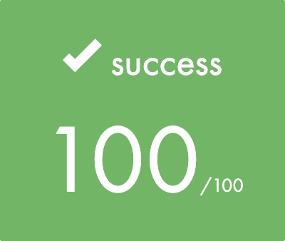
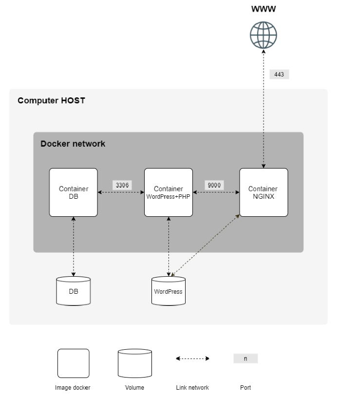
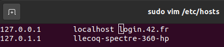
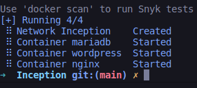

<p align="center">
  <a href="https://42lyon.fr/">
    
  </a>

  <h2 align="center">inception</h2>

  <p align="center">
    <br>
    One container isn't enough. We need to go deeper.
    <br>
    The images for each service are build on an alpine base for a lightweight solution.
    <br>
    <a href="./assets/en.subject.pdf">English Subject </a>
  </p>
</p>


## Table of contents

- [Quick start](#quick-start)
- [What's included](#whats-included)
- [Creators](#creators)


## Quick start

This document is a System Administration related exercise.

<p align="center">
  
</p>

You first need to have docker engine installed on your linux host machine.

In the env. file, replace all the informations by the one needed and the everything will be automatized by the Makefile.


You will need to modify the /etc/hosts file on your hosts machine to allow redirections to your [login].42.fr address.
```
sudo vim /etc/hosts
```


Then, you are all set ! Make and wait for the services to be up.
```
make
```


## What's included

```
Inception
├── assets
│   ├── en.subject.pdf
│   └── final grade.png
├── Makefile
├── README.md
└── srcs
    ├── docker-compose.yml
    ├── .env
    └── requirements
        ├── mariadb
        │   ├── Dockerfile
        │   └── tools
        │       └── docker-entrypoint.sh
        ├── nginx
        │   ├── conf
        │   │   ├── nginx.conf
        │   │   └── sites-available
        │   │       └── llecoq.42.fr.conf
        │   ├── Dockerfile
        │   └── tools
        │       └── docker-entrypoint.sh
        └── wordpress
            ├── conf
            │   └── www.conf
            ├── Dockerfile
            └── tools
                └── docker-entrypoint.sh
```

## Creators

**llecoq**

- <https://github.com/llecoq>
